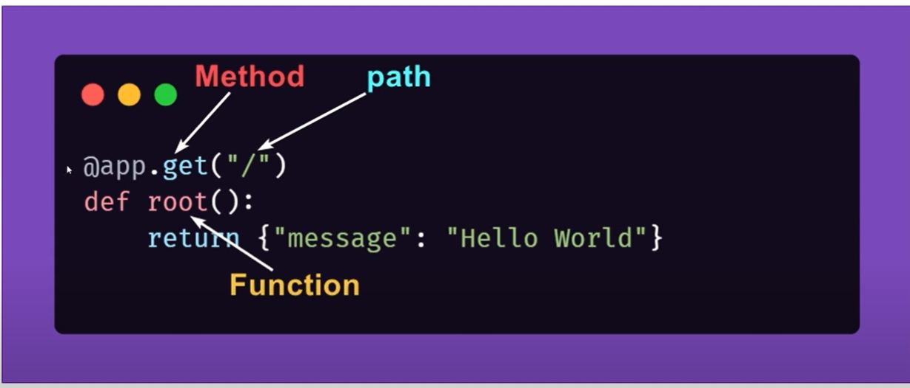
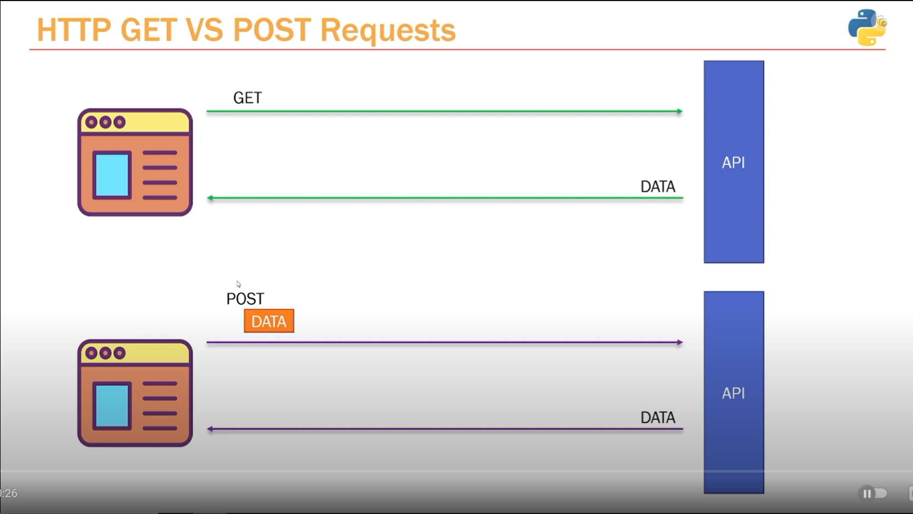
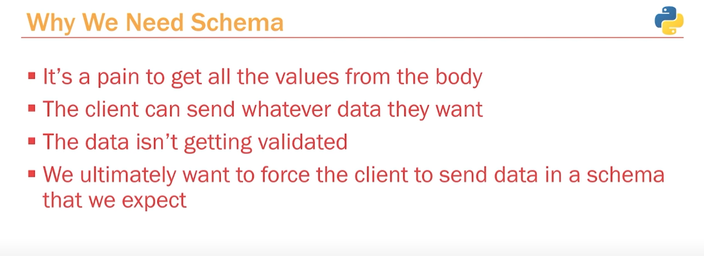
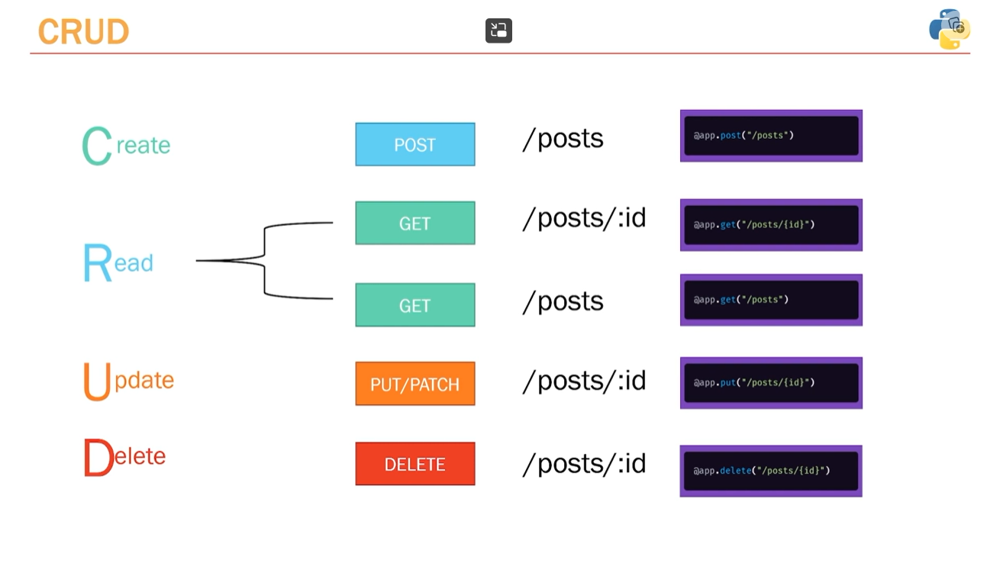
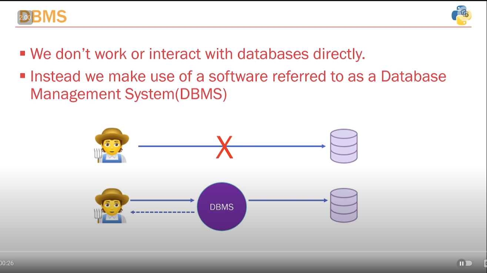
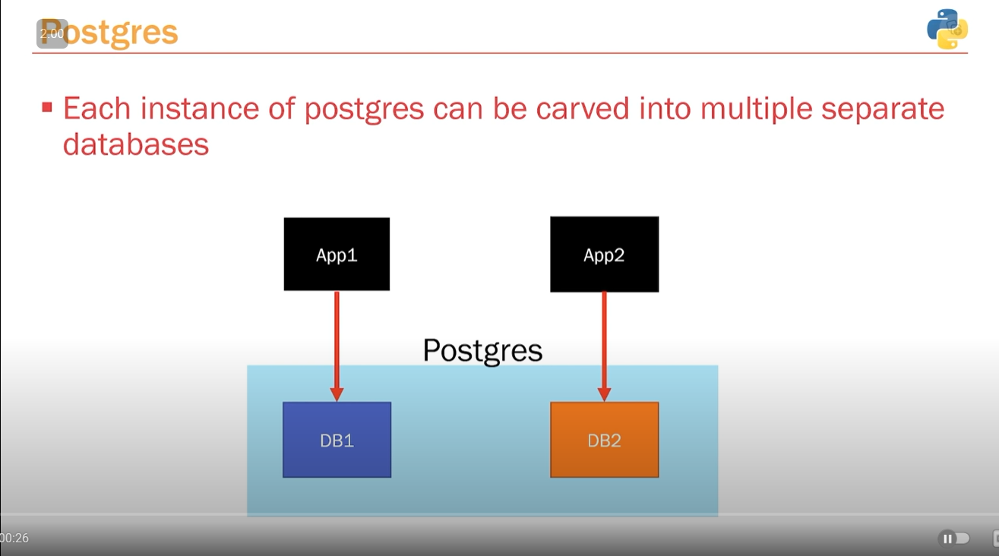

**Youtube Link: https://www.youtube.com/watch?v=0sOvCWFmrtA**

### Virtual Env
- Allows us to create isolated envs for installing python packages.
- Are isolated to that project folder so can name all the virtual envs as venv only.
- Change interpreter to python file in bin.
- Also to activate venv: source venv/bin/activate.

### Path Operation

- FastAPi uses the first PO that it comes accross so if two PO use the same path it will use the first one.

### Postman
- Easy to test APIs

### POST Requests

- Use to create things like a social media posts.

### Pydantic - Why dbs are better than body of HTTP

### CRUD

### Databases

